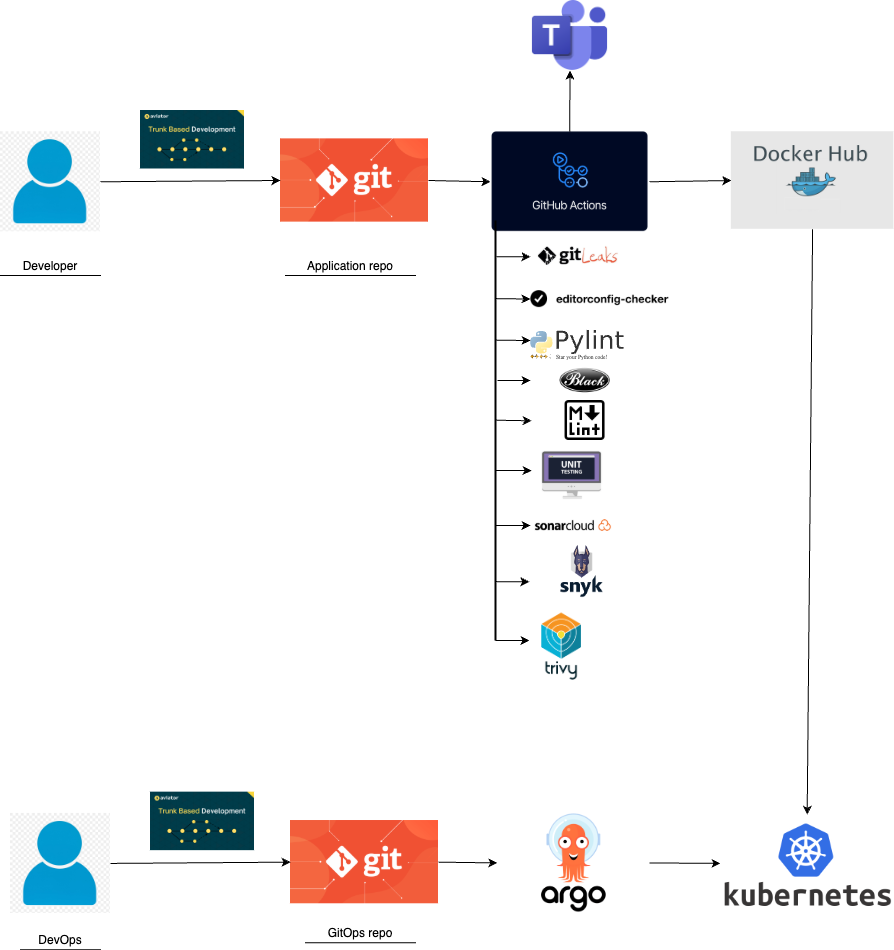

# FastAPI Starter

A boilerplate application to start developing microservices in Python.

## Tests

To run the tests, use the following command:
```shell
pytest
```

To run the tests with coverage, use the following command:
```shell
pytest --cov=app --cov-report=term-missing
```

## Docker

To build the Dockerfile locally, use the following commands:
```shell
docker build . -t [image-name]:[tag] -f /path/to/Dockerfile
```
```shell
docker run -d tag
```
Then open a browser and navigate to http://localhost:8000. If it opens "Hello world", then it works.

## Workflows

Two workflows are available in the project. One triggers on pull requests, and another triggers on merges. A workflow that triggers on every push is not created, as it may consume excessive resources and exceed the budget.

### **Pull Request Workflow**
To run the ***fastapi_pr.yml*** pipeline, a pull request should be made to the main branch on GitHub. This will trigger the pipeline, which can be monitored in the GitHub -> Actions tab. The workflow includes the following checks:
- **GitLeaks**: Scans for sensitive information in the codebase.
- **EditorConfig**: Ensures consistent coding styles.
- **Python PyLint**: Checks for Python code quality.
- **Python Black**: Formats Python code to adhere to PEP 8 standards.
- **MarkdownLint CLI**: Validates Markdown files for proper formatting.
- **Unit Tests**: Runs the test suite to ensure code correctness.

### **Merge Workflow**
To run the ***fastapi_merge.yml*** workflow, a pull request should be merged into the main branch on GitHub. This will trigger the pipeline, which can also be monitored in the GitHub -> Actions tab. The workflow includes the following steps:
- **SonarCloud**: Performs static code analysis for code quality and security.
- **Snyk**: Scans for vulnerabilities in dependencies.
- **Trivy**: Scans Docker images for vulnerabilities.
- **Docker Image Build and Push**: Builds the Docker image and pushes it to Docker Hub.

## ArgoCD

### Prerequisites
- Installed ***kubectl*** command-line tool.
- Installed ***Docker Desktop*** or another external Kubernetes cluster.

### Install ArgoCD
To install ArgoCD, create a namespace for it:
```shell
kubectl create namespace argocd
```
Then apply the installation manifest:
```shell
kubectl apply -n argocd -f https://raw.githubusercontent.com/argoproj/argo-cd/stable/manifests/install.yaml
```

### Download ArgoCD CLI (MacOS Example)
```shell
brew install argocd
```

### Port Forwarding
To access the ArgoCD UI, forward the port:
```shell
kubectl port-forward svc/argocd-server -n argocd 8080:443
```

### Login via UI
Navigate to *https://localhost:8080* in your browser. The certificate will be invalid, but you can proceed. Use the following credentials:
- **Username**: `admin`
- **Temporary Password**: Extract it using the command below (exclude the `%` symbol at the end):
```shell
kubectl -n argocd get secret argocd-initial-admin-secret -o jsonpath="{.data.password}" | base64 -d
```
Update the password:
```shell
argocd account update-password
```

### Create Applications via UI
1. Log in to the ArgoCD UI.
2. Click the '+ New App' button.
3. Provide the following details:
   - **Application Name**: `app`
   - **Project**: `default`
   - **Sync Policy**: `Manual`
   - **Repository URL**: `https://github.com/boyanaboneva/devops-gitops`
   - **Revision**: `HEAD`
   - **Path**: `devops-service-deployment`
   - **Destination Cluster**: `https://kubernetes.default.svc`
   - **Namespace**: `application`
4. Click 'Create'.

### Sync (Deploy) the Application
If the application's health status is "Out of sync," click the 'Sync apps' button in the UI. Then, click 'Synchronize' to deploy the application. You can view more details by clicking on the application.

## Kubernetes Deployment

The deployment files are stored in a separate GitOps repository: [https://github.com/boyanaboneva/devops-gitops](https://github.com/boyanaboneva/devops-gitops).

### Create a Namespace
Create a namespace for the application:
```shell
kubectl create namespace application
```

### Apply ConfigMap
Navigate to the GitOps repository and apply the environment variables ConfigMap:
```shell
kubectl apply -f env_fastapi_configmap.yml
```

### Apply Deployment
Navigate to the Kubernetes deployment folder in the GitOps repository and apply the deployment manifest:
```shell
kubectl apply -f deployment.yml -n application
```
Expected response:
```shell
deployment.apps/fast-api-deployment created
```

### Verify Deployment
Check the pods in the namespace:
```shell
kubectl get pods -n application
```
Expected response:
```shell
NAME                                   READY   STATUS    RESTARTS   AGE
fast-api-deployment-66ff55bb64-cmkbl   1/1     Running   0          22s
```

### Apply Service
Apply the service manifest:
```shell
kubectl apply -f service.yml -n application
```
Expected response:
```shell
service/fastapi-service configured
```

## Architecture Overview

This project follows a modern DevOps architecture that integrates **GitHub**, **GitHub Actions**, **ArgoCD**, **Docker Hub**, and **Kubernetes**. Below is a detailed explanation of the architecture:

### Key Components
1. **GitHub**: Hosts the application code and a separate GitOps repository for Kubernetes manifests.
2. **GitHub Actions**: Automates CI/CD workflows, including building, testing, and pushing Docker images.
3. **Docker Hub**: Stores Docker images for deployment.
4. **Kubernetes**: Orchestrates containerized applications, ensuring scalability and reliability.
5. **ArgoCD**: Implements GitOps principles by syncing Kubernetes manifests from the GitOps repository to the cluster.

### Workflow Summary
1. Developers push code changes to GitHub.
2. GitHub Actions builds the application, runs tests, and pushes Docker images to Docker Hub.
3. The GitOps repository is updated with the new image tag in the Kubernetes manifests.
4. ArgoCD detects changes in the GitOps repository and syncs them to the Kubernetes cluster.

This architecture ensures a seamless CI/CD pipeline with automated deployments, version control, and rollback capabilities.

## Software Architecture Diagram

